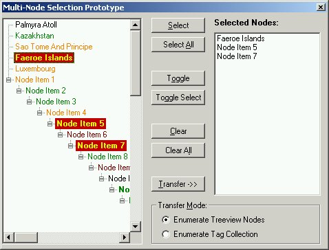



## TreeView Multi\-Node Selection

### Description

Have you ever wanted to add Multi-Node Selection to your application? Many people here and in the newsgroups have wanted this feature. Here is a working prototype! Enjoy...
 
### More Info
 
At this stage no keyboard support is implemented.

             |
---                |---
**Submitted On**   |2002-01-24 18:15:52
**By**             |[Slider](https://github.com/Planet-Source-Code/PSCIndex/blob/master/ByAuthor/slider.md)
**Level**          |Intermediate
**User Rating**    |4.5 (36 globes from 8 users)
**Compatibility**  |VB 6\.0
**Category**       |[Custom Controls/ Forms/  Menus](https://github.com/Planet-Source-Code/PSCIndex/blob/master/ByCategory/custom-controls-forms-menus__1-4.md)
**World**          |[Visual Basic](https://github.com/Planet-Source-Code/PSCIndex/blob/master/ByWorld/visual-basic.md)
**Archive File**   |[TreeView\_M506641242002\.zip](https://github.com/Planet-Source-Code/slider-treeview-multi-node-selection__1-31118/archive/master.zip)

### API Declarations

Nil! None! Nada! Zip!

